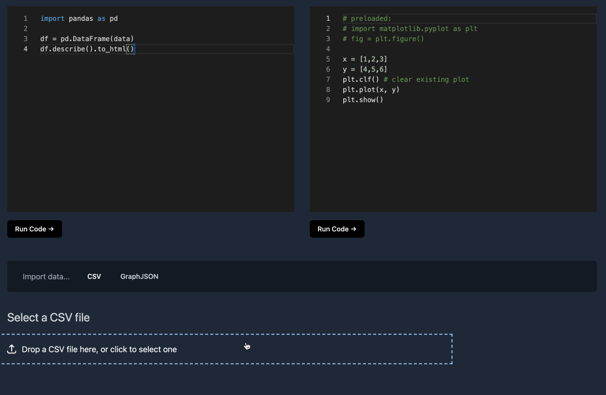

# Pyground

Pyground is a Python data playground that runs in your browser using Pyodide.

It allows importing a CSV file into a Python editor where it can be freely manipulated using common libraries. A Python editor that outputs a figure to a canvas is also provided. Dates in the document are converted to native Python DateTime objects so that they can be easily manipulated/plotted.

The app is entirely static, never stores your data or sends it anywhere and can be self-hosted anywhere.

## Demo

A live version is deployed at https://pyground.vercel.app

## Supported import types

- CSV file
- [GraphJSON](https://www.graphjson.com): any collection, any date range.

## Deploy

With Vercel: 

Pyground is written in NextJS with all pages able to be rendered as static HTML. See [NextJS docs](https://nextjs.org/docs/deployment) for other deployment options

## Limitations

- Python runs in the browser using [Pyodide](https://pyodide.org) so their limitations apply. See in particular https://pyodide.org/en/stable/usage/wasm-constraints.html

- The matplotlib render doesn't work in Safari, and that editor is therefore hidden. This includes all iOS browsers. See https://github.com/pyodide/pyodide/issues/1921

- Your data is loaded in the browser, so the supported size will depend on your machine. You can almost certainly find a CSV file that's too big!

- Currently only [packages built in Pyodide](https://pyodide.org/en/stable/usage/packages-in-pyodide.html#packages-in-pyodide) are supported, and they're automatically imported when used. There's not yet any support for loading other packages.
